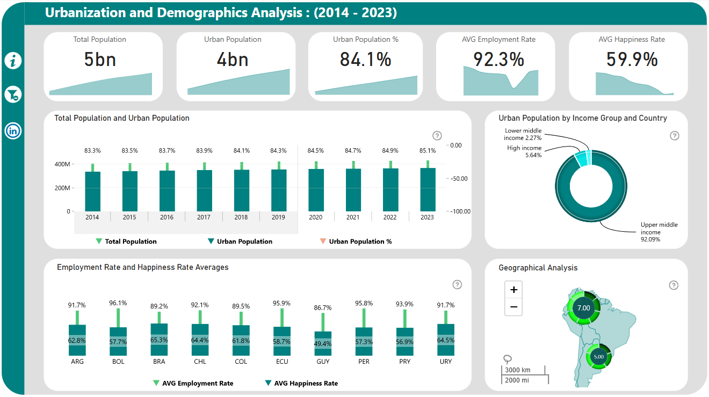

# Urbanization & Demographics Analysis (2014-2023)

This project explores urbanization trends and demographic shifts over the last decade, offering insights into how population growth, urban development, and various socio-economic factors are shaping our cities and communities.

See the full dashboard here - [App Power BI link](https://app.powerbi.com/view?r=eyJrIjoiNzNkOGYwYTQtZTAwNi00YWJkLTkwYWMtZDQwMGZjMjQzZmQxIiwidCI6IjQ2NTRiNmYxLTBlNDctNDU3OS1hOGExLTAyZmU5ZDk0M2M3YiIsImMiOjl9)

